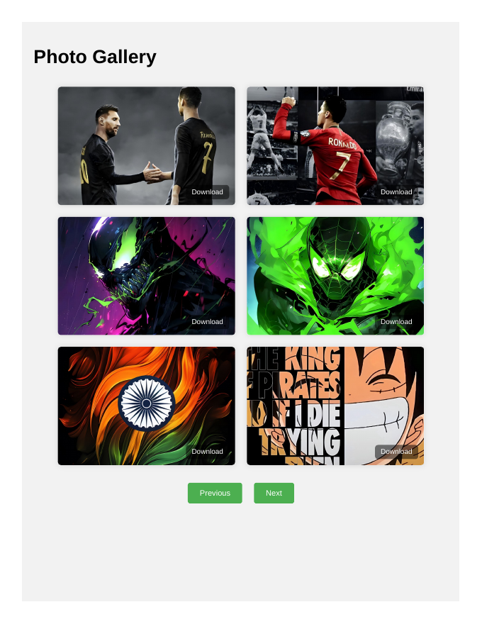

# Photo-Gallery-PC

> ## Status: 🟢 Completed
>
> <progress value="90" max="100"></progress>
>
> **Progress: 90%** — 50-photo desktop gallery with working pagination; minor cleanup left

<p align="center">
  
</p>


## Screenshots

<p align="center">
  
  <br />
  <em>Desktop photo gallery — 50 photos.</em>
</p>


## What it is

The desktop counterpart to Photo-Gallery-PHONE: the same 50-photo static gallery, but with a desktop-optimised stylesheet (`d1.css` is the only file that differs between the two repos). Same card grid, download buttons, and Previous/Next pagination cycling six photos at a time. Pure HTML/CSS/vanilla JS, zero dependencies.

## What works (verified)

- ✅ All 50 photos (`photo1.jpg`–`photo50.jpg`) exist and are byte-identical to the PHONE version — verified with `diff`
- ✅ `prev()`/`next()` pagination with wraparound — verified in the inline script
- ✅ Download buttons on every card — verified in the markup
- ✅ Desktop CSS layout (wider grid) — verified `d1.css` differs from the PHONE version

## Tech stack

| Layer | Technology |
|---|---|
| Markup | HTML5 |
| Styling | CSS3 (desktop grid layout) |
| Logic | Vanilla JavaScript (inline) |
| Assets | 50 local JPEGs |

## How to run

No build needed — just open it:

```bash
# option 1: open directly
open index.html        # macOS
# option 2: serve locally
python3 -m http.server 8000
# then visit http://localhost:8000
```

## Screenshots

The gallery itself is the visual — 50 photos in a card grid. Banner above.

## What you can add more

- [ ] Include photo49/photo50 in the slider rotation — same gap as the PHONE version (JS array stops at photo48)
- [ ] Merge with Photo-Gallery-PHONE into one responsive site — two near-identical repos differ only in CSS; a single repo with media queries would be cleaner
- [ ] Add a lightbox view on click — currently clicking a photo does nothing
- [ ] Lazy-load images — 50 full JPEGs load up front

## Project structure

```
Photo-Gallery-PC/
├── index.html      # gallery markup + inline pagination JS
├── d1.css          # desktop-optimised gallery styles
├── photo1.jpg … photo50.jpg  # 50 gallery photos
├── banner.webp
└── README.md
```

---
*README written after code audit on 2026-10-08.*
